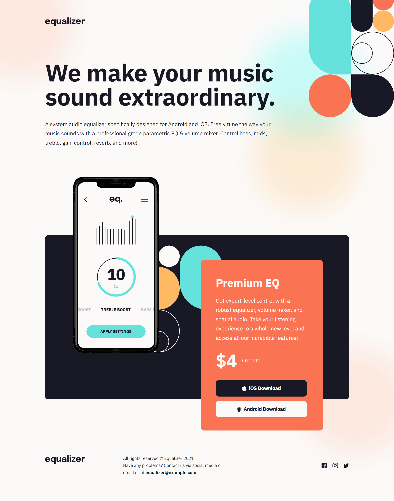
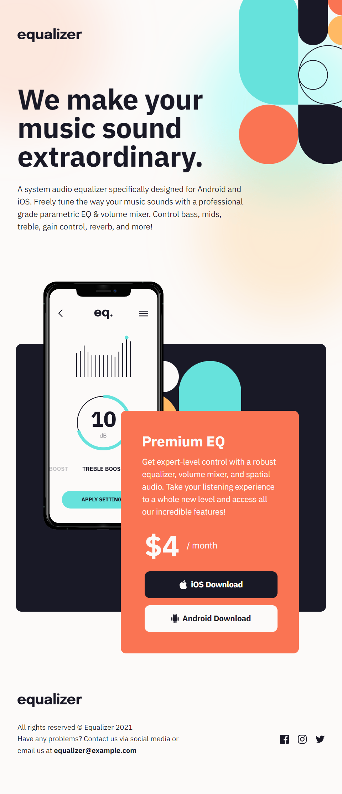
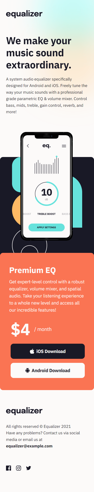

# Frontend Mentor - Equalizer landing page solution

This is a solution to the [Equalizer landing page challenge on Frontend Mentor](https://www.frontendmentor.io/challenges/equalizer-landing-page-7VJ4gp3DE). Frontend Mentor challenges help you improve your coding skills by building realistic projects.

## Table of contents

- [Frontend Mentor - Equalizer landing page solution](#frontend-mentor---equalizer-landing-page-solution)
  - [Table of contents](#table-of-contents)
  - [Overview](#overview)
    - [Screenshot](#screenshot)
    - [Links](#links)
  - [My process](#my-process)
    - [Built with](#built-with)
    - [What I learned](#what-i-learned)
    - [Continued development](#continued-development)
    - [Useful resources](#useful-resources)
  - [Author](#author)
  - [Acknowledgments](#acknowledgments)

## Overview

This is my solution to the Equalizer Landing Page challenge. This is a landing
page for a mobile app called equalizer that uses Svelte, Vite, TypeScript and
custom SCSS. The user can get information about the product and links to
download the app either from the iOS App Store or the Android Play Store. The
user can also get in contact with the company using the social sites or through email.

### Screenshot





### Links

- Solution URL: [GitHub](https://github.com/newbpydev/11-equalizer-landing-page-svelte-ts-vite-scss)
- Live Site URL: [Live Site](https://playful-halva-f374b3.netlify.app/)

## My process

### Built with

- Semantic HTML5 markup
- SCSS custom properties
- Flexbox
- Svelte + Vite + TypeScript

### What I learned

I have learned on this project that we need to practice everyday and work hard
to really understand how everything works, specially with the images background.
I will have to review this topic better.

```scss
&::before {
  content: "";
  position: absolute;
  top: -25rem;
  left: 0rem;
  background-image: url("./assets/images/bg-main-mobile.png");
  background-size: cover;
  background-repeat: no-repeat;
  width: 58.2rem;
  height: 78rem;
  z-index: -10;

  @media screen and (min-width: 48em) {
    background-image: url("./assets/images/bg-main-tablet.png");
    width: 128.3rem;
    height: 110.8rem;
    left: -30rem;
  }

  @media screen and (min-width: 68.75em) {
    background-image: url("./assets/images/bg-main-desktop.png");
    width: 191.3rem;
    height: 205.8rem;
    left: -35rem;
  }

  @media screen and (min-width: 89em) {
    left: -27rem;
  }
}
```

### Continued development

For future development, I will continue to use background-image for divs so I
could practice more the placement of the image in the element.

### Useful resources

- [CSS-TRICKS - Centering CSS Complete Guide](https://css-tricks.com/using-svg/) - If you have two or more block-level elements that need to be centered horizontally in a row, chances are you’d be better served making them a different display type. Here’s an example of making them inline-block and an example of flexbox....
- [MDN - background-image](https://developer.mozilla.org/en-US/docs/Web/CSS/background-image) - The background-image CSS property sets one or more background images on an element.

## Author

- Website - [Juan Gomez](https://www.newbpydev.com)
- Frontend Mentor - [@newbpydev](https://www.frontendmentor.io/profile/newbpydev)
- Twitter - [@Newb_PyDev](https://twitter.com/Newb_PyDev)

## Acknowledgments

The code may not be perfect compared to my sensei @jonasschmedtman but I need
to thank him because he has shown me the ropes and now I am a confident web
designer.
